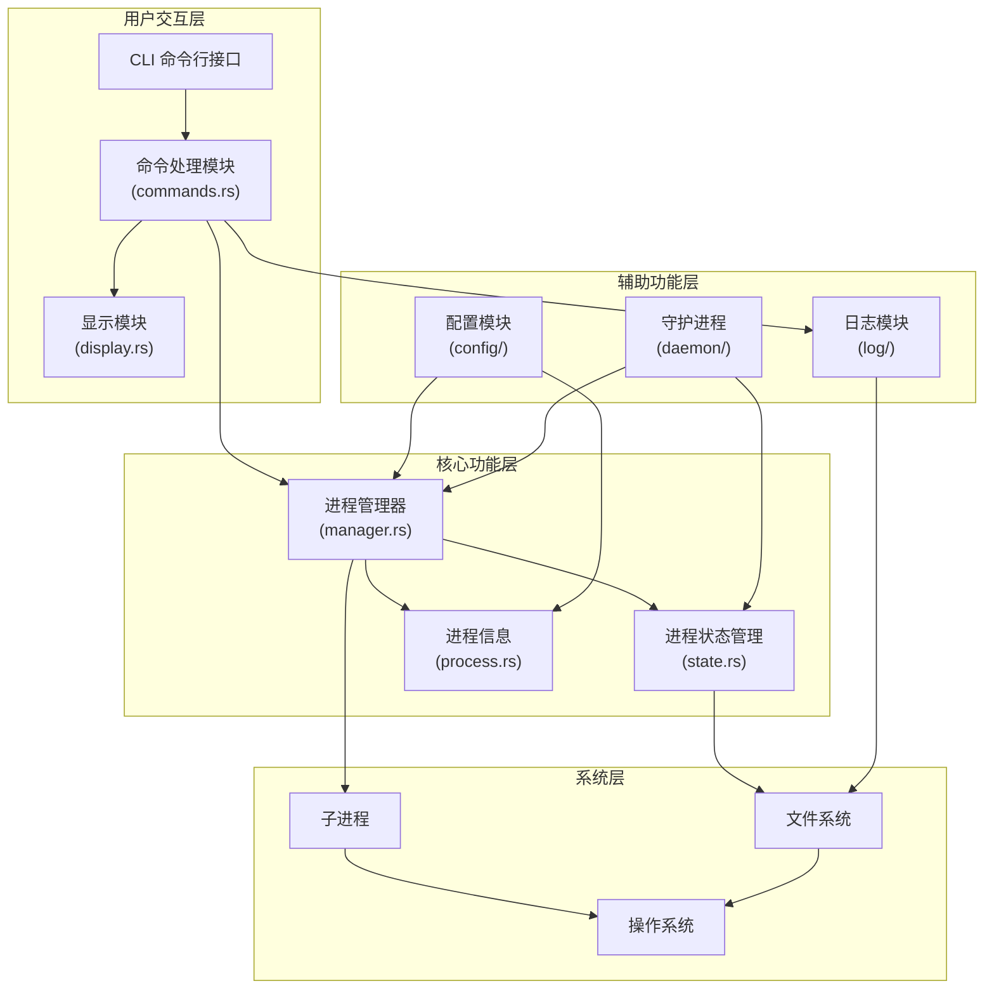

# PM2 - Rust Process Manager

[](https://www.rust-lang.org/)
[](LICENSE)

一个用 Rust 编写的高性能进程管理器，灵感来源于 Node.js 的 PM2。支持多种编程语言的应用程序管理，提供进程监控、日志管理、集群模式等功能。

## ✨ 功能特性

- 🚀 **多语言支持** - 支持 Node.js、Python、Go、Shell 脚本和二进制程序
- 📊 **进程监控** - 实时监控 CPU、内存使用情况和运行时间
- 🔄 **自动重启** - 进程崩溃时自动重启，支持最大重启次数限制
- 📝 **日志管理** - 标准输出和错误输出分离，支持日志文件配置
- 🔄 **日志轮转** - 支持按大小、时间间隔自动轮转日志文件
- ⚙️ **多种配置格式** - 支持 TOML、YAML、JSON 配置文件
- 🌐 **集群模式** - 支持多实例集群部署
- 🎯 **灵活的进程管理** - 支持按名称、ID 删除进程，支持批量操作
- 💾 **状态持久化** - 进程状态保存到文件，重启后自动恢复
- 🔧 **环境变量管理** - 支持环境变量配置和注入

## 📦 安装

### 从源码编译

```bash
# 克隆仓库
git clone https://github.com/songlands/pm2-rust.git
cd pm2-rust

# 编译发布版本
cargo build --release

# 二进制文件位于 target/release/pm2
sudo cp target/release/pm2 /usr/local/bin/
```

### 系统要求

- Rust 1.70 或更高版本
- Linux/Unix 系统

## 🚀 快速开始

### 启动应用

```bash
# 启动 Node.js 应用
pm2 start app.js --name my-app

# 启动 Python 应用
pm2 start app.py --name python-app

# 启动 Go 二进制程序
pm2 start ./my-binary --name go-app

# 使用配置文件启动
pm2 start ecosystem.toml
pm2 start ecosystem.yaml
pm2 start ecosystem.json
```

### 查看进程列表

```bash
pm2 list
```

输出示例：
```
+----------+---------------+------+--------+-----------------+---------+--------+------+-------+------+----------+
| id       | name          | mode | pid    | status          | restart | uptime | cpu  | mem   | user | watching |
+----------+---------------+------+--------+-----------------+---------+--------+------+-------+------+----------+
| 1186455d | node-server   | fork | 12345  | online          | 0       | 2m     | 0.5% | 45.2MB| root | disabled |
+----------+---------------+------+--------+-----------------+---------+--------+------+-------+------+----------+
```

### 查看进程详情

```bash
# 按名称查看
pm2 show my-app

# 按 ID 查看
pm2 show 1186455d
```

### 停止进程

```bash
# 按名称停止
pm2 stop my-app

# 按 ID 停止
pm2 stop 1186455d
```

### 重启进程

```bash
# 按名称重启
pm2 restart my-app

# 按 ID 重启
pm2 restart 1186455d
```

### 删除进程

```bash
# 按名称删除
pm2 delete my-app

# 按 ID 删除
pm2 delete 1186455d

# 删除所有进程
pm2 delete all
```

## 📝 配置文件

### TOML 格式

#### 单个应用配置 (app.toml)

```toml
name = "http-server"
script = "app.js"
instances = 1
exec_mode = "fork"
watch = false
max_memory_restart = "500M"
log_file = "./logs/http-server.log"
error_file = "./logs/http-server-error.log"
cwd = "."
autorestart = true
max_restarts = 15

[env]
NODE_ENV = "production"
PORT = "3000"
HOST = "0.0.0.0"
```

#### 生态系统配置 (ecosystem.toml)

```toml
[[apps]]
name = "api-server"
script = "api.js"
instances = 4
exec_mode = "cluster"
max_memory_restart = "1G"
log_file = "./logs/api.log"
error_file = "./logs/api-error.log"

[apps.env]
NODE_ENV = "production"
PORT = "3000"

[[apps]]
name = "web-server"
script = "web.js"
instances = 2
exec_mode = "cluster"
max_memory_restart = "500M"

[apps.env]
PORT = "3001"
```

### YAML 格式

#### 单个应用配置 (app.yaml)

```yaml
name: http-server
script: app.js
instances: 1
exec_mode: fork
watch: false
max_memory_restart: 500M
log_file: ./logs/http-server.log
error_file: ./logs/http-server-error.log
cwd: .
autorestart: true
max_restarts: 15

env:
  NODE_ENV: production
  PORT: "3000"
  HOST: 0.0.0.0
```

#### 生态系统配置 (ecosystem.yaml)

```yaml
apps:
  - name: api-server
    script: api.js
    instances: 4
    exec_mode: cluster
    max_memory_restart: 1G
    log_file: ./logs/api.log
    error_file: ./logs/api-error.log
    env:
      NODE_ENV: production
      PORT: "3000"

  - name: web-server
    script: web.js
    instances: 2
    exec_mode: cluster
    max_memory_restart: 500M
    env:
      PORT: "3001"
```

### JSON 格式

```json
{
  "apps": [
    {
      "name": "api-server",
      "script": "api.js",
      "instances": 4,
      "exec_mode": "cluster",
      "max_memory_restart": "1G",
      "log_file": "./logs/api.log",
      "error_file": "./logs/api-error.log",
      "env": {
        "NODE_ENV": "production",
        "PORT": "3000"
      }
    }
  ]
}
```

## ⚙️ 配置选项

### 基本选项

| 选项 | 类型 | 默认值 | 说明 |
|------|------|--------|------|
| `name` | String | - | 应用名称（必需） |
| `script` | String | - | 脚本路径（必需） |
| `instances` | Number | 1 | 实例数量 |
| `exec_mode` | String | "fork" | 执行模式：fork 或 cluster |
| `cwd` | String | "." | 工作目录 |

### 监控选项

| 选项 | 类型 | 默认值 | 说明 |
|------|------|--------|------|
| `watch` | Boolean | false | 是否监听文件变化 |
| `max_memory_restart` | String | - | 内存限制重启（如 "500M", "1G"） |
| `autorestart` | Boolean | false | 是否自动重启 |
| `max_restarts` | Number | 15 | 最大重启次数 |

### 日志选项

| 选项 | 类型 | 默认值 | 说明 |
|------|------|--------|------|
| `log_file` | String | - | 标准输出日志文件 |
| `error_file` | String | - | 错误日志文件 |
| `out_file` | String | - | 输出日志文件 |
| `merge_logs` | Boolean | false | 是否合并日志 |

### 日志轮转选项

| 选项 | 类型 | 默认值 | 说明 |
|------|------|--------|------|
| `log_rotate_size` | String | - | 日志文件大小限制（如 "10M", "100MB", "1G"） |
| `log_rotate_count` | Number | 10 | 保留的轮转文件数量 |
| `log_rotate_interval` | String | - | 轮转时间间隔（如 "1d", "12h", "30m"） |

**日志轮转配置示例：**

```yaml
apps:
  - name: api-server
    script: api.js
    log_file: ./logs/api.log
    error_file: ./logs/api-error.log
    # 日志轮转配置
    log_rotate_size: 20M        # 日志文件大小达到 20MB 时轮转
    log_rotate_count: 5         # 保留 5 个轮转文件
    log_rotate_interval: 1d     # 每天轮转一次
```

**支持的单位：**
- 大小单位: `B`, `K/KB`, `M/MB`, `G/GB`（如 `10M`, `100MB`, `1G`）
- 时间单位: `s/sec/second`, `m/min/minute`, `h/hour`, `d/day`（如 `30s`, `5m`, `2h`, `1d`）

### 环境变量

| 选项 | 类型 | 说明 |
|------|------|------|
| `env` | Map | 默认环境变量 |
| `env_production` | Map | 生产环境变量 |
| `env_development` | Map | 开发环境变量 |

## 📊 监控

### 实时监控

```bash
pm2 monit
```

显示实时的 CPU、内存使用情况和进程状态。

### 查看日志

```bash
# 查看所有日志
pm2 logs

# 查看特定应用的日志
pm2 logs my-app

# 查看最近 50 行日志
pm2 logs my-app --lines 50

# 实时跟踪日志
pm2 logs my-app --follow
```

## 🎯 命令行选项

### start 命令

```bash
pm2 start <script|config> [options]

选项:
  --name <name>              进程名称
  --instances <number>       实例数量
  --cluster                  集群模式
  --watch                    监听文件变化
  --max-memory-restart <mem> 内存限制重启
  --log <file>               日志文件路径
  --error-log <file>         错误日志文件路径
  -e, --env <KEY=value>      环境变量（可多次使用）
```

### 其他命令

```bash
pm2 list                    # 列出所有进程
pm2 show <name|id>          # 显示进程详情
pm2 stop <name|id|all>      # 停止进程
pm2 restart <name|id>       # 重启进程
pm2 delete <name|id|all>    # 删除进程
pm2 monit                   # 实时监控
pm2 logs [name]             # 查看日志
pm2 flush                   # 清空日志
pm2 rotate [name]           # 手动轮转日志
pm2 log-files [name]        # 查看日志文件列表
pm2 save                    # 保存进程列表
pm2 resurrect               # 恢复保存的进程
pm2 kill                    # 停止守护进程
```

## 📁 项目结构

```Mermaid
pm2/
├── src/
│   ├── main.rs              # 程序入口
│   ├── cli/                 # 命令行界面
│   │   ├── commands.rs      # 命令实现
│   │   └── display.rs       # 显示格式化
│   ├── config/              # 配置管理
│   │   ├── mod.rs           # 配置结构
│   │   └── parser.rs        # 配置解析
│   ├── process/             # 进程管理
│   │   ├── mod.rs           # 进程定义
│   │   ├── manager.rs       # 进程管理器
│   │   └── state.rs         # 状态管理
│   ├── daemon/              # 守护进程
│   └── log/                 # 日志管理
├── examples/                # 示例应用
│   ├── go-server/           # Go HTTP 服务器
│   ├── node-server/         # Node.js HTTP 服务器
│   ├── python-server/       # Python HTTP 服务器
│   └── config/              # 配置文件示例
├── Cargo.toml               # Rust 配置
└── README.md                # 项目文档
```

## 🏗️ 系统架构

### 架构图



### 模块关系

| 模块 | 主要职责 | 文件位置 | 依赖关系 |
|------|---------|----------|----------|
| **CLI** | 命令行参数解析 | `src/main.rs` | 依赖 Commands |
| **Commands** | 实现具体命令逻辑 | `src/cli/commands.rs` | 依赖 ProcessManager、Log |
| **Display** | 终端输出格式化 | `src/cli/display.rs` | 无外部依赖 |
| **ProcessManager** | 进程生命周期管理 | `src/process/manager.rs` | 依赖 ProcessState、ProcessInfo |
| **ProcessState** | 进程状态持久化 | `src/process/state.rs` | 依赖 Filesystem |
| **ProcessInfo** | 进程信息结构 | `src/process/process.rs` | 无外部依赖 |
| **Config** | 配置文件解析 | `src/config/` | 无外部依赖 |
| **Log** | 日志处理与轮转 | `src/log/` | 依赖 Filesystem |
| **Daemon** | 守护进程管理 | `src/daemon/` | 依赖 ProcessManager |

### 核心流程

1. **命令执行流程**：
   - 用户输入命令 → CLI 解析 → Commands 处理 → ProcessManager 执行 → 状态更新 → 显示结果

2. **进程管理流程**：
   - 启动进程 → 创建 ProcessInfo → 记录到 ProcessState → 监控进程状态 → 处理退出

3. **日志处理流程**：
   - 进程输出 → 写入日志文件 → 检查轮转条件 → 执行日志轮转

4. **状态管理流程**：
   - 进程状态变更 → 更新内存状态 → 持久化到文件 → 读取恢复状态

## 🔧 开发

### 构建

```bash
# 开发版本
cargo build

# 发布版本
cargo build --release
```

### 运行测试

```bash
cargo test
```

### 代码检查

```bash
cargo clippy
cargo fmt
```

## 📄 示例应用

项目包含三个示例应用，用于测试 PM2 功能：

### Go HTTP 服务器

```bash
cd examples/go-server
go build -o go-server
./go-server
```

默认端口：3001

### Node.js HTTP 服务器

```bash
cd examples/node-server
node app.js
```

默认端口：3002

### Python HTTP 服务器

```bash
cd examples/python-server
python3 app.py
```

默认端口：3004

## 🤝 贡献

欢迎提交 Issue 和 Pull Request！

### 贡献指南

1. Fork 本仓库
2. 创建特性分支 (`git checkout -b feature/AmazingFeature`)
3. 提交更改 (`git commit -m 'Add some AmazingFeature'`)
4. 推送到分支 (`git push origin feature/AmazingFeature`)
5. 创建 Pull Request

## 📜 许可证

本项目采用 MIT 许可证 - 查看 [LICENSE](LICENSE) 文件了解详情。

## 🙏 致谢

- 灵感来源于 [PM2](https://github.com/Unitech/pm2)
- 使用 Rust 生态系统中的优秀库

## 📮 联系方式

- 项目主页: https://github.com/yourusername/pm2
- 问题反馈: https://github.com/yourusername/pm2/issues

## 🔮 路线图

- [ ] Web UI 界面
- [ ] 集群负载均衡
- [ ] Docker 支持
- [ ] Kubernetes 集成
- [ ] 性能指标导出
- [ ] 告警通知
- [ ] 进程依赖管理
- [ ] 热重载支持

---

**注意**: 这是一个正在积极开发的项目，API 可能会发生变化。建议在生产环境使用前进行充分测试。
